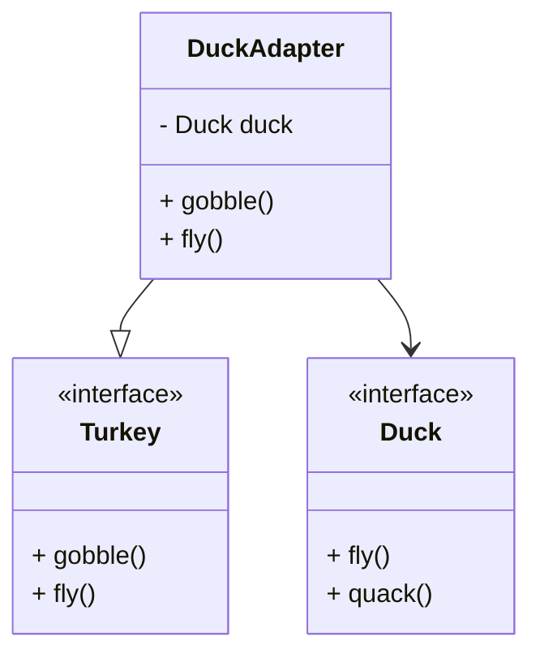
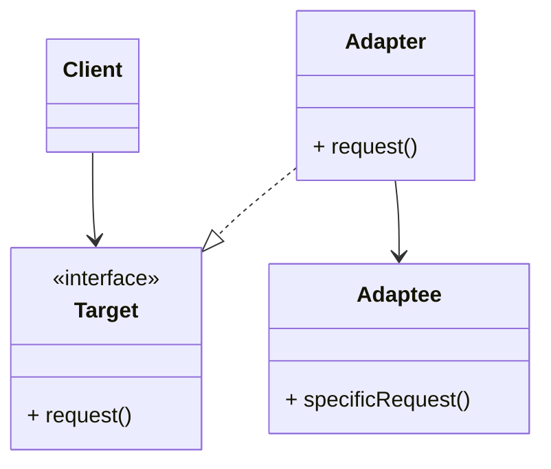
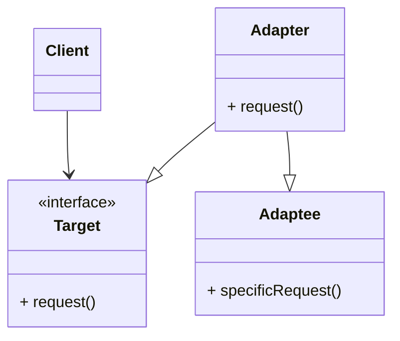
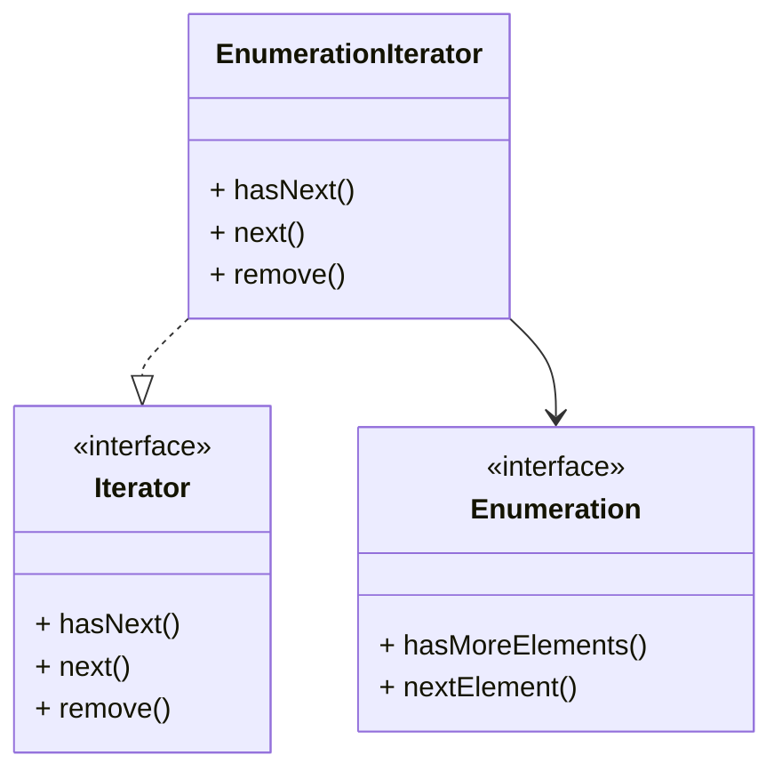

# The Adapter

🪄 Atempt impossible feats as putting square in round hole. 

### Adpaters all around us

Euro Wall Outlet --- AC Power Adapter --- Standard AC Plug

What we know about the adapter
- It sits between the plug of laptop and the Euro AC outlet.

## Object oriented adapters

You get an existing software system, you need to work a new vendor class, but the new vender designed their interfaces differently.

Existing System -- ❌ -- Vendor Class

Some way to solve
- Change Existing System interface is indiot
- You can't change vendor's classes
- Write your adapter


Existing System -- Adapter -- Vendor Class

The adapter converst client's request into vendor's class

- Existing system : no change
- Adapter : new code
- Vendor class : no change

🦆: If it walks like a duct and quack like a duck, it might be a turkey wraped a duct with duck adapter.

```java
public interface Duck  {
  public void quack();
  public void fly();
}

public class MallardDuck implements Duck {
  public void quack() {
    // Print quack
  }

  public void fly() {
    // Print flying
  }
}
```

Time to add turkey

```java
public interface Turkey {
  public void gobble();
  public void fly();
}

public class WildTurkey implements Turkey {
  public void gobble() {
    // Print gobble
  }

  public void fly() {
    // Print fly short
  }
}
```
I want to use Turkey objs in Duck objs place.

```java
public class TrukeyAdapter implements Duck {
  Turkey turkey;

  public TurkeyAdapter(Turkey turkey) {
    this.turkey = turkey;
  }

  public void quack() {
    turkey.gobble();
  }

  public void fly() {
    for(int i = 0; i < 5; i++)
      turkey.fly();
  }
}
```

Let write an Adapter
1. Implement the interface of the type you're adapting to.
2. Get the reference to the object we are adapting (in ctor).
3. Implement all the methods.


## The adapter pattern explained


- The client si implemented against the target interface.
- The adapter impelemtns the target interface and hold the instance of the Adaptee.

### How the Client uses the Adapter
1. The client makes a request to the adapter by calling a method on it using the target interface.
2. The adapter translates the request into one or more calls on the adaptee using the adaptee interface.
3. The Client receives the results of the call and never knows there is an adapter doing the translation.

💡 Client and Adapptee are decouped, neither knows about the other.

Let create an adapter Duck to Turkey


### Questions
Q: Does an adapter always wrap one and only one class ?
A: No, in some situations when an adapter hodls 2 or more adaptee

Q: I have old & new parts of my system, the old parts expect the old vendor interface, but we have written the new parts to use new vendor interface ?

## Adapter Pattern defined

**The Adapter Pattern** converts the interface o a class into another interface the client expect. Adapter lets classes work together that couldn't other because incompatible interfaces.

Now, we can use the client with incompatible interface by create an Adapter. Decoupled the client from the implement interface.

Two kinds of adapters
- Object adapter 
- Class adapter


Below is class adapter(it uses multiple inheritance and depend on language).



## Real world adapters

Old java use Enumerators, new use Iterators. We faced with leagacy code that exposes the Enumerator interface, our new code uses only Iterator.
We need to adapt Enumeration(Adaptee interface) to Iterator(Target interace).



### Dealing the remove() method

Enumerations is read only interface, implementation remove() throws UnsupportedOperationException. This case is adapter isn't perfect.

```java
public class EnumerationIterator implements Iterator {
  Enumeration enum;

  public EnumerationIterator(Enumeration enum) {
    this.enum = enum;
  }

  public boolean hasNext() {
    return enum.hasMoreElements();
  }

  public Object next() {
    return enum.nextElement();
  }

  public void remove() {
    throw new UnsupportedOperationException();
  }
}
```

### 🧠 Power
Some AC adapters do more than just change the interface – they add other features like surge
protection, indicator lights and other bells and whistles.
If you were going to implement these kinds of features, what pattern would you use?

Adapter + decorator pattern

Decorator: doesn't alter the interface, but adds responsibility

Adapter: converts one interface to another

Facade: makes an interface simpler