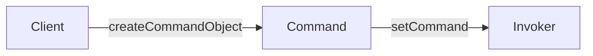
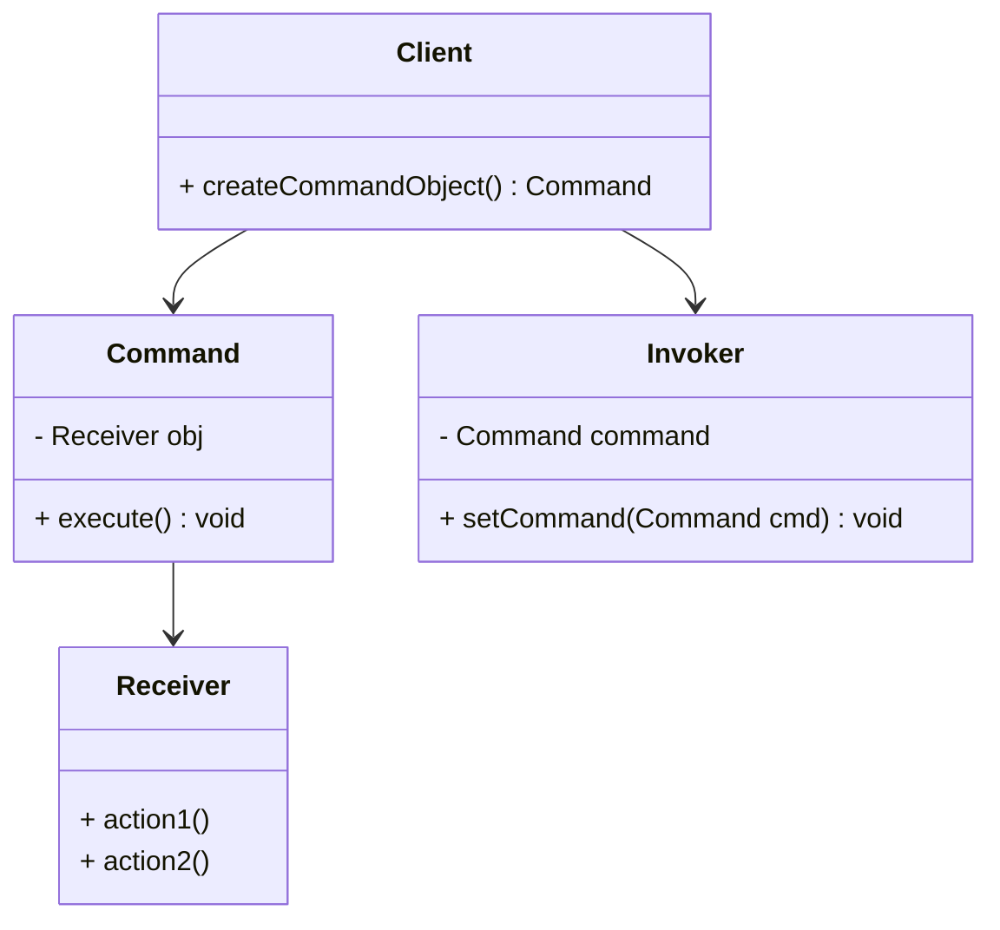
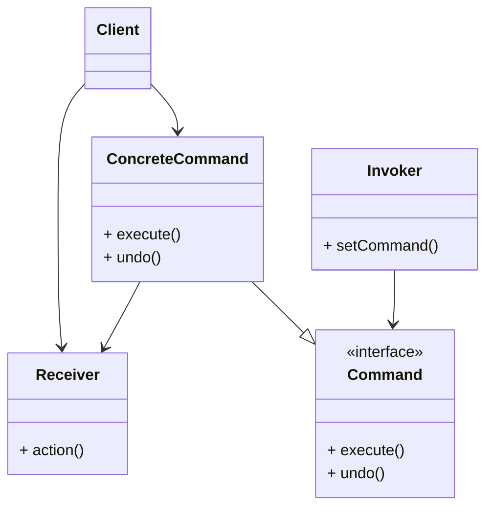
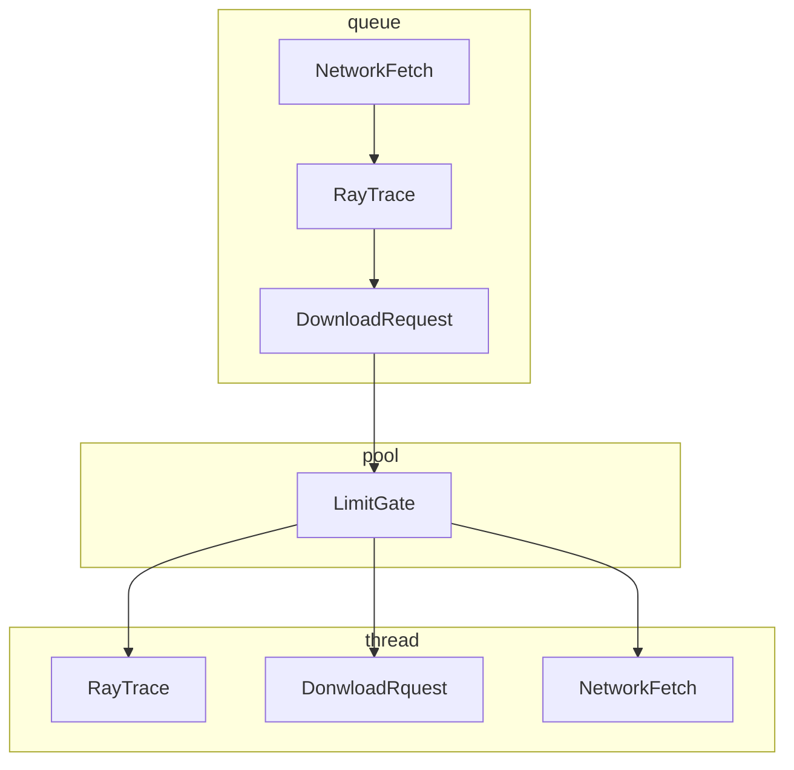

# The commnad pattern

🦖 New level, we are going to encapsulate method invocation.

Home automation or bust.

New expanable weather station Weather-O-Rama. A remote prototype, control perusal. The remote has 7 feature slots (each can be assigned
to different device) along with corresponding ON/OFF buttons for each.
The remote has an undo button.
Varous vendor, provide various devices such as lights, fans, hobs, audio.
We create an API for programing the remote, so that each slot can be assigned to control a device or set devices.

**IMPORTANT:** we be able to control the curent devices on the disc, and also future devices.

```
The remote design
Slot   ON  OFF
1️⃣     🔘  🔘
2️⃣     🔘  🔘
3️⃣     🔘  🔘
4️⃣     🔘  🔘
5️⃣     🔘  🔘
6️⃣     🔘  🔘
7️⃣     🔘  🔘
      UNDO 🟥 
```

The command pattern allows you to decouple the requester of an action
from the obj that actually performs the action.
The remote is the requester, devices are obj that actual performs the action.
Introduce a new "command objects" in to desing(buttons). Command object
ecapsulates a request to do smt. If we store  the command object for each button, when the the button is pressed we ask the command object to do smt.
The remote has no idea about the work is.

### Understand Command pattern in the Diner
1. Customer gives Waitress a Order
2. Waitress takes Order, say "Order up!"
3. Short-Order Cook prepares your Order

Create Order: The customer knows what he wants and create an order.

The order consists of an order slip, order items.

Order Up: The waitress takes the Order, and calls "Order Up!" to begin prepare.

The order has all the instructions to prepare.

Make Order Items: Chef follows the instructions of the Order.

### Roles and responsibilities
- Client: create command obj.
- Command Obj: consist of a set of actions, encapsulate the cations of Receiver.
- Receiver: consist actions.
- Invoker: store the Command Obj.




Class diagram


1. The Client create Command obj.
2. The Client set the Command obj to Invoker.
3. Later client asks Inovker to execute the Command obj.


💡 Match Diner to Command Pattern
- Waitress is Invoker
- Short Order Cook is Receiver
- orderUp() is execute()
- Order is Command
- Customer is Client
- takeOrder is setCommand()

💡 Design remote
Command obj is behavior of device, Remote is Invoker, client is remote's code program.

## The command pattern defined
**The Command Pattern** encapsulates a request as an obj, thereby letting you parameterize other obj with differnt requests, queue or log requests, and support undoable operations.

🐔: How we encapsulate a request ?

🐕: Binding a set of actions on a specific receiver. The execute() method is exposed, contains receiver's method.

🦄: Meta Command Pattern supports queues and logs, un do operations.


- Client creates ConcreteCommand and setting its Receiver
- Reciver knows about Receiver's action
- ConcreteCommand defines a binding between an action and Receiver. Invoker make a request by call execute(), execute() call Receiver.action().

🎉 Remote needs a party mode

Push one button and have the lights dimmed, the stereo and TV turned on and set a DVD and the hot tub fired up.

🦆: Create a command hold objects (idiots)
🦖: Create a command hold commands

### Dumb questions
1. Why  can't command object imp details of the execute() ?
  You can do this but you will no longer have the same level of decoupling between Invoker
and Receiver

2. How can I implement multiple undo ?
  Use list command instead a single command obj. Better use stack :)

3. Could I have just implemented Party Mode as a Command by creating a PartyComamnd and the calls to execute the other command in execute() ?
  Yes you could, but it is "hardcoding", essential of Macro is dynamic binding and flexibility.

## More uses of the Command Pattern: queing request 🐕 🦆 🙎
Commands are the ways to package the reciver and actions. Pass it around.
Action can be executed after other commands.
Think about Thead, actions can be executed in different thread 🤯.
Apply it to usefull application as schedulers, thread ppls, and job queues...


1. Commands are passed in to queue.
2. A filter manages the creation of thread, limit thread.
3. Threads remove commands from the queue can call execute() method.


### More uses o Command Pattern: logging requests

Applications require logging and e able to recover after a crash. Edit Command with a store() and load() methods.

### Bullet points
- Command Pattern decouple requester and executer.
- Command Obj is center of decoupling and encapsulate receiver with actions.
- Invoker asks Receiver execute an anction by call execute() in Command Obj.
- Command can support undo method.
- MacroCommand is a good extesion for multiple commands to be invoked. Also suport undo.
- Command obj implements action is "Smart Command" but it is **not smart**.
- Command used to implement logging and transactional.