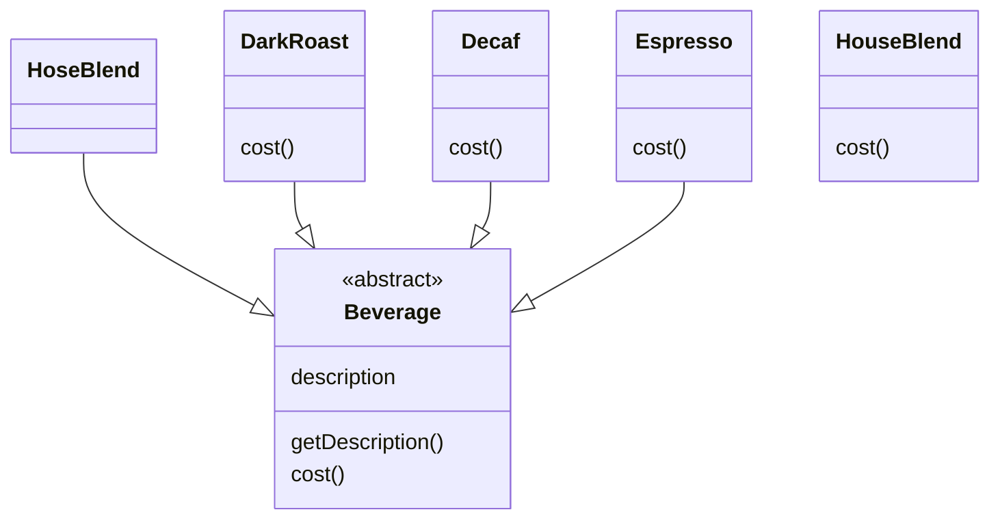
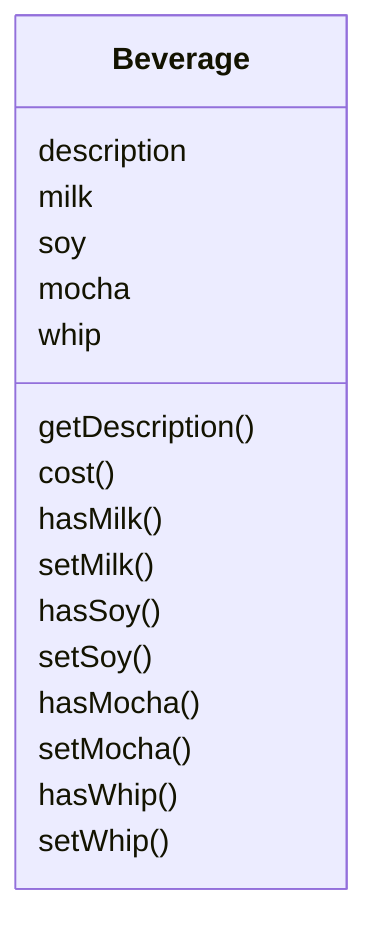

# The Decorator Pattern

🤯 The Power of extension at runtime, rather than at compile time.

## Wellcome to Starbuzz Coffee ☕

First design

### Branin Power
If 100 coffee types used milk, then if milk price change, nightmare for maintaince.
What do I do if I want add a new topping ?

Try to add some topping instance variables and redesign

Above design, subclass not need to override cost() method, the cost() is implemented in base class.

Changes will impact this design
- Price changes for comdiments, force us to alter existing code
- New condiments will be added, must alter base class
- Customer want double mocha
- Some beverages may not be appropriate, Tea has Soy is an example

Inheriatnace is powerfull but it doesn't always lead to the most flexible or maintainable designs.

How to achieve resuse if not through inheritance ?

The ways of inheriting behaviour at runtime through composition and delegation.

⚙️ Use inherit behaviour by subclassing, behaviour is set statically at compile time.
🦄 Can extend an object's behaviour through composition, then reuse
behaviour at runtime.