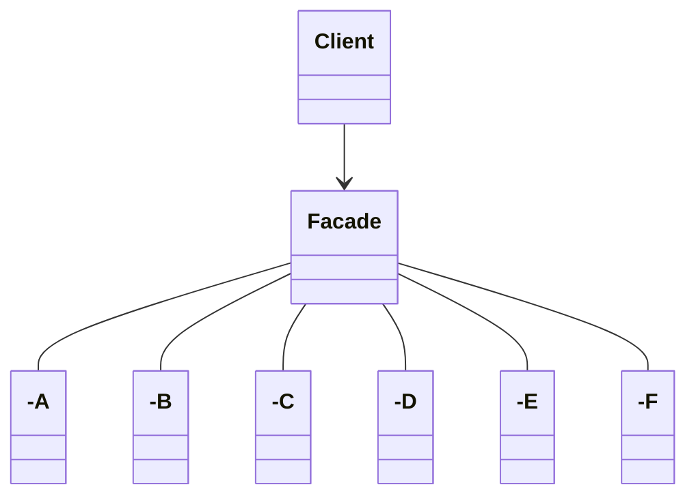

# The Facade Pattern

## Home Sweet Home Theate
When you want to watch a movie.

```java
popper.on();
popper.pop();
lights.dim(10);
asses
Six different cl
involved!
screen.down();
projector.on();
projector.setInput(dvd);
projector.wideScreenMode();
amp.on();
amp.setDvd(dvd);
amp.setSurroundSound();
amp.setVolume(5);
dvd.on();
dvd.play(movie);
```

But
- When the movie is over, how do you turn everything off ?
- Would it be as complext to listen to a CD or the radio ?
- If you upgrade your system, you have going to have to learn a slightly different procedure.

## Facade
A facade is just what you need: with Facade Pattern you can take a complex subsystem and make it easier to use by imp a Facade class that provide one, more reasonable interface.
All you need is a straightforward interface.

💡A facade not only simpliies an itnerface, it decouples a client from a subsystem of components.

Facades and adapters may wrap multiple classes, but a facade's intent is to simplify, while an adapter's is to convert the  interface to something different.

## Facade Pattern defined
We create a class that simpliies and unifies a set of more complext classes that belong to some subsystem. 
Facade is straightforward, no mind bending absttractions to get your head around.
The facade allows us to avoid **tight** coupling between clients and subsystems.

**The Facade Pattern** provides a unified interface to set of interfaces in a subsystem. Facade defines a higher-lever interface that makes the subsystem easier to use.


## The principle off Least knowledge
Guide us to reduce the interaction between obj to just a few close "friends"

### Design Principle
Principle of least Knowledge talk only to your immediate friends.