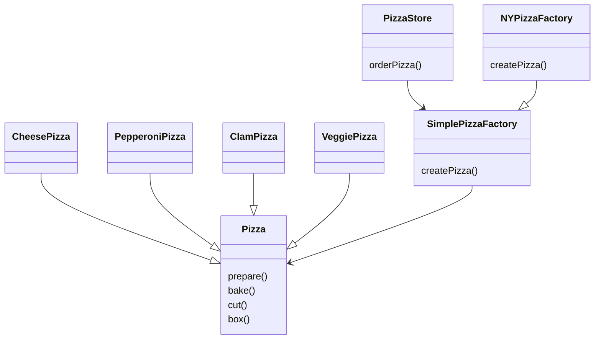
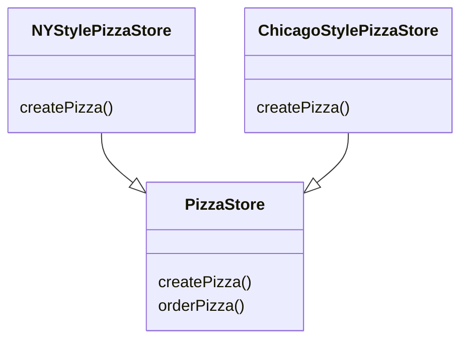
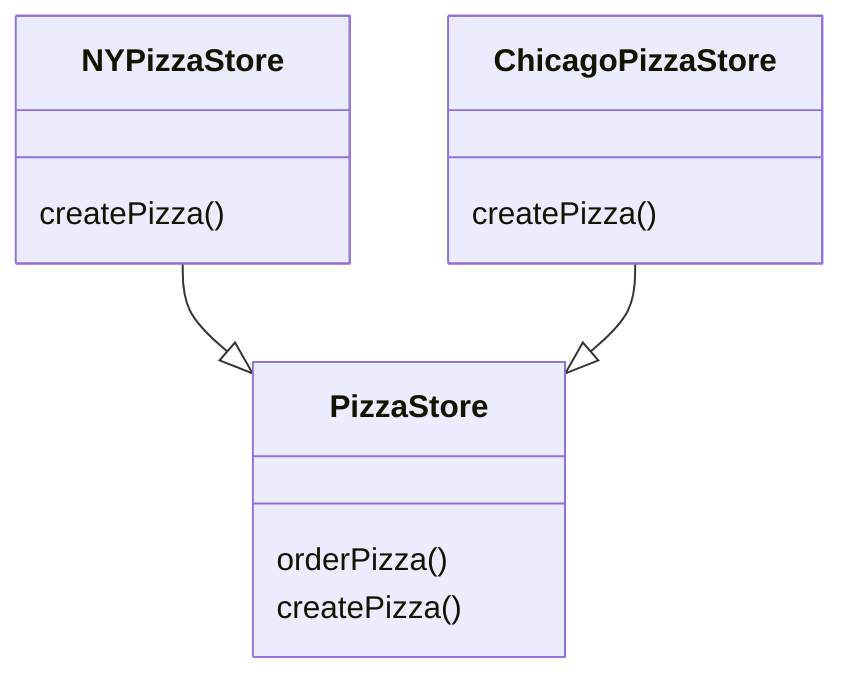
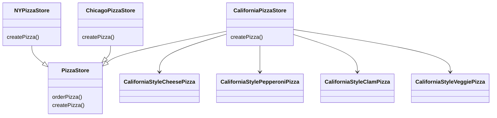
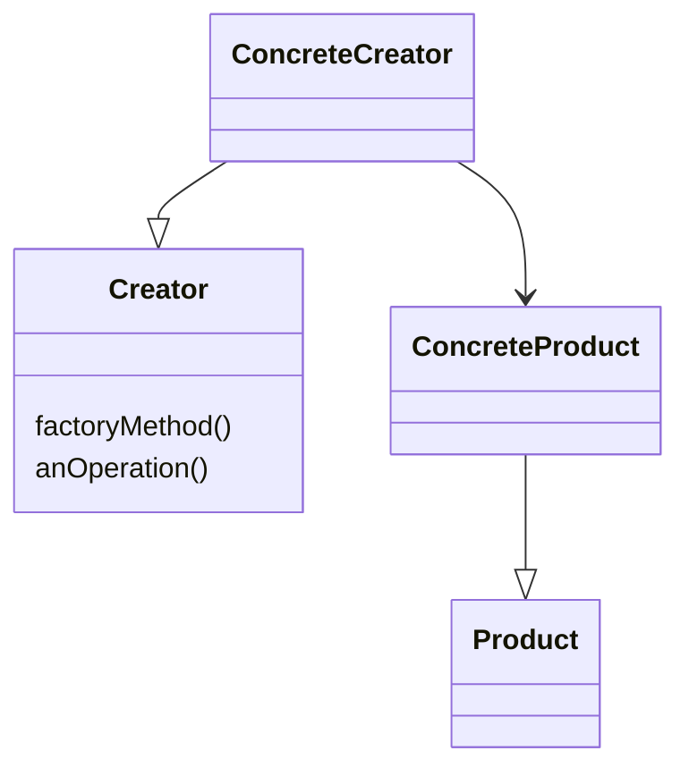

# The factory pattern

PizzaStore: the client of the factory, client goes through the factory to get instance of pizza.

SimplePizzaFactory: the factory where we crate pizza. Factory should be only part refer to concrete Pizza classes.

Allowing the subclasses to decide

The factory pattern encapsulates object creation by letting subclasses decide what object to create

PizzaStore: abstract creator class, define abstract factory method. Often the creator contains code that **depends on** an abstract product(method orderPizza), which is produced by a subclass. The creator never really knows which concreate product was produced.

NYPizzaStore, ChicagoPizzaStore: Classes that produce products are called concrete creators.

### 🧩 Desing Puzzle

### Factory Method Pattern defined
**The Factory Method Pattern** defnies an interface for creating an
object, but lets subclasses decide which class to instantiate. Factory Method lets a class defer instantiation to subclasses.

## The Dependency Inersion Principle
Reduce dependencies to concrete classes is a good thing👌

### Design Principle
Depend upon abstractions. Do not depend upon concrete classes.

High level compoents should not depend on low-level components. They should both depend on abstractions.

In example, pizza store is high-level component, pizza implementatios are low-level compoment. PizzaStore is dependent on the concrete pizza classes.

Guidelines help you avoid OO designs that violate the DIP:
- No variable hold a ref to a concrete class.
- No class should derive from concrete class.
- No method should override an implemened method of any of its base classes.