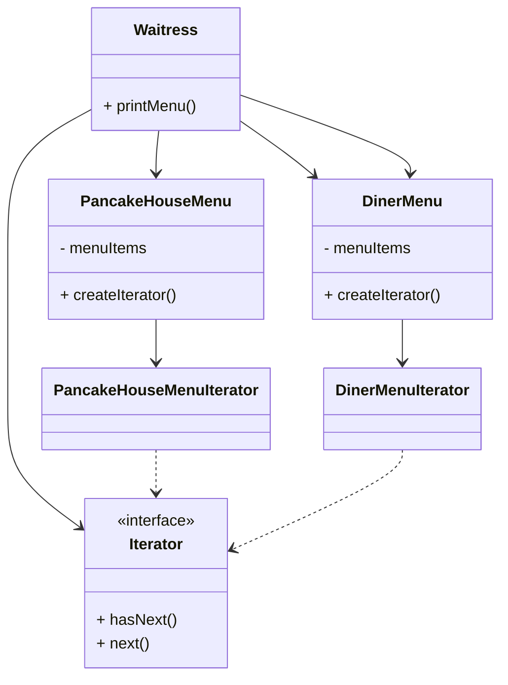
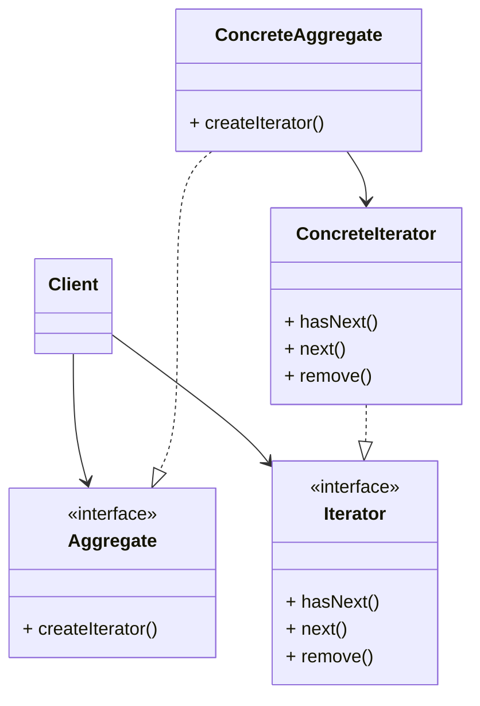

# The Iterator and Composite Patterns
===

## Breaking News: Object ville Diner and Object ville Pancake House Merge

Based on our implementation of printMenu(), which of the following apply?

- [x] A. We are coding to the
PancakeHouseMenu and DinerMenu
concrete implementations, not to an
interface.
- [x] B. The Waitress doesn’t implement the
Java Waitress API and so she isn’t
adhering to a standard.
- [x] C. If we decided to switch from using
DinerMenu to another type of menu
that implemented its list of menu items
with a Hashtable, we’d have to modify
a lot of code in the Waitress.
menu represents its internal collection of
menu items; this violates encapsulation.
- [x] E. We have duplicate code: the printMenu()
method needs two separate loops to
iterate over the two different kinds of
menus. And if we added a third menu,
we’d have yet another loop.
- [ ] F. The implementation isn’t based on
MXML (Menu XML) and so isn’t as
interoperable as it should be.

## What now ?
Don't want to change old implementations because it would meen rewriting a lot of code 
that is in each respective menu class.

We could find a way to allow them to implement the same interface or thir menus.
Except for the getMenuItems() method return different type. We can minimize the concrete ref inthe waitress code and get rid fo the multiple loops required to iterate over both menu.

## Can we encapsulate the iteration ?
💡 Encapsulate what varies.
The iteration caused by different collections of obj being returned from the getMenuItem() method.

1. To iterative we use the size() and get() method from ArrayList
2. To iterative we use the length and [i] method from Array
3. Now create an Iterator obj has hasNext() and next()

## What have we done so far ?
Hard to Maintain Waitress Implementation
- The Menus are not well encapsulated
- We need two loops to iterate through the MenuItems
- The Waitress is bound to concrete classes (MenuItem[] and ArrayList)
- The Waitress is bound to different cocrete Menu classes

New, Hip Waitress Powered by Iterator
- The Menu implementations are now encapsulated. The Waitress has no idea how the menus hold collection
- All we need is a loop that polimorphically handles
- The Waitress now use interface Yterator

### Making some imporvements...

PancakeHouseMenu and DinerMenu are extractly same.

## Iterator Pattern defined

**The Iterator Pattern** provides a way to access the elements of an aggregate object sequentially without exposing its underlying representation.

The Iterator pattern gives you a way to step through the elements of an aggregate without having
to know how things are represented under the cover.
One you have a uniform way of accesing the elements of all aggregate objects.

##### Aggregate
Commont interface for aggregates is handy for client, it **decouples** client from the implementation of collection of objects(ConcreteAggregate)

##### ConcreteAggregate
Has collection of objs and imp the emthod that return Iterator for its collection

##### Iterator
Interface provides the interface that all iterators must imp, and set method for traversing over
elements of a collection

##### ConcreteIterator
Responsible for managing the current position of the iteration.
Each ConcreteAggregate is responsible for create ConcreteIterator over its collection of objs

##### The class diagram for the Iterator Pattern looks very similar to another Pattern you’ve studied; can you think of what it is? Hint: A subclass decides which object to create.
Factory pattern

## There are no Dumb Questions

### I’ve seen other books show the Iterator class diagram with the methods first(), next(), isDone() and currentItem(). Why are these methods different?

Those are classic method names that have used.

### I’ve heard about “internal” iterators and “external” iterators. What are they? Which kind did we implement in the example?
External iterator means the client controls the iteration by calling next() (we implemented).

Internal iterator is controlled by the iterator itself. That means you need a way to pass an operation to the iterator to tell what to do when iterate(pass lamda to forEach method).

### Could I implement an Iterator that can go backwards as well as forwards?
Yes, add previous() method and other few method like method check you are at begin position

### Who defines the ordering of the iteration in a collection like Hashtable, which are inherently unordered?
Iterator imply no ordering, odering depend on collection implementation.

### You said we can write “polymorphic code” using an iterator; can you explain that more?
When we write methods that take Iterator as param. We are using polymorphic iteration.

## Single Responsibility

**Design Principle:** A class should have only one reason to change.