**A shared vocabulary**
Design Patterns give you a shared vocabulary with other developers,
easy to comunicate with other developers, elevates your thinking about architectures by letting you think at pattern level

One of the secrets to creating maintainable OO systems is thinking 
about how they might change in the future and these principles 
address those issues

**🧰 Tools or your Design Toolbox**

**OO Basics**
- Abstraction
- Encapsulation
- Polimorhism
- Inheritance

**OO Principles**
- Encapsulate what varies
- Favor composition over inheritence
- Program to interfaces, not implementations

**OO Patterns**
- Issues the change

🌤️ Weather-O-Rama
=================
The weather station is based on WeatherData object(temperature, humidity, and barometric pressure).
Create an application that provies 3 display elements: current conditions, weather statistics and simple forecast. All updated in real time.
The Weather-O-Rama wants to release an API so that other developers can write their own weather display and plug them in.

```mermaid
graph LR
H[💧Humidity sensor] --- W[📡Weather Station]
T[🌡️Temperature sensor] --- W
P[🕐Pressure sensor] --- W
W --- |pulls data| D[📦Weather Data]
D --- |displays| S[🖥️Display Device]

```



Based on first implementation
- [x] A. We are coding to concrete impelementations, not interface
- [x] B. Fore every new display element we need to alter code
- [x] C. We have no way to add (or remove dispaly elements at runtime)
- [ ] D. The display element don't implement a common interface
- [x] E. We haven't encapsulated the part that changes
- [ ] F. We are violating encapsulation of the WeatherData class

**Publishers + Subscribers = Observer Pattern**


- Subject manage data
- The observers have subscribed to the Subject to receive updates when data changes
- When data in Subject changes, the observers are notified
- The object is not an observer, it does not get notified when Subject's data changes

**The Observer Pattern** defines a 1-to-many dependency between objects so that when one
objec change state, all of it dependents are notified and updated automatically.


###The power of Loose Coupling
The 2 objects are losely coupled, they can interact, but have every little knowledge of
each other.

The Observer Pattern provides an object design where subjects and observers are loosely
coupled.

**But have every little knowledge of each other ?**
The subject and observers know about they are implemented a certain interface. They don't
need to know extrach concrete class.

**We can add new objsevers at any time**
The only thing the subject depends on is a list of objects that implement the Observer 
interface. We can add new observers or remove old observers at run time.

**We can reuse subjects ore observers independently of each other**

**Changes to either the subject or an observer will not affect the other**
Changes are free, only to meet impement interface.

**Design Principle**
Strive for loosely coupled designs between objects that interact.

Losely coupled designs allow us to build flexible OO systems.


```java
public interface Observer {
  void update(float temp, float humidity, float pressure);
}
```
Pass args to update method in Observer interface is straighforward but think about what the changes might in the future. What happend when when want to add location,
should we encapsulate args to a data object ?

**Design Principle Chanllenge**

Foreach design priciple, describle how the Observer Pattern meets.

`Identiffy the aspects of your application that vary and separate then from what stays the same.`
Register and remove observers, each observer has special implement when interact with 
notification(encapsulate to Observer interface)

`Program to an interface, not an implementation`
Interaction between Subject and Ojbservers throught notify and update in 2 type interface

`Favor composition over inheritance`
To use Subject methods, Observer uses Subject instance
To use Observer methods, Subject uses Observer instance