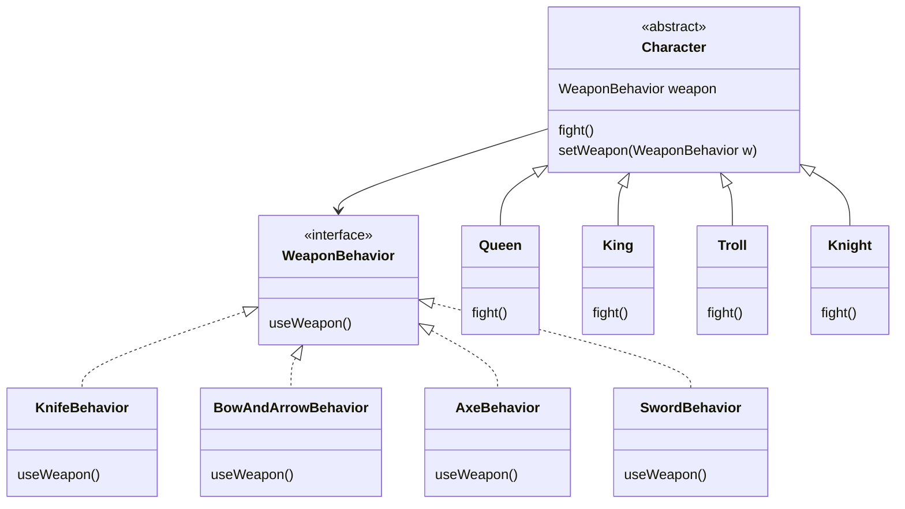

HAS-A CAN BE BETTER THAN IS-A
=============================

**Design Principle**
Favor composition over inheritance

Using composition gives you a lot more flexibility. Allow encapsulate a family of algorithms into set of classes, also lets you change behavior at runtime

**The Strategy Pattern**
Defines a family of algorithms, encapsulates each one, and makes them interchangeable.
Stratergy lets the algoritm vary independently from clients that use it.

**🧩 Design Puzzle**
