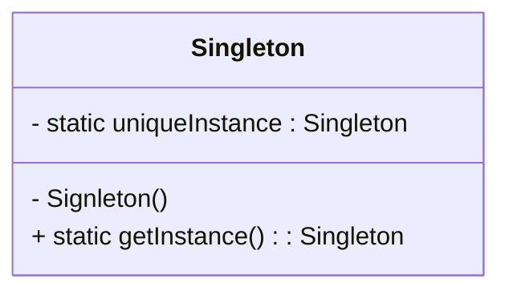

# Singleton Pattern

🤖 Create one of a kind object for which these is only one instance.

Many object you only need one of them: thread pools, caches, dialog box, registry setting, logging, driver to 
device.

Singleton is a convension for ensuring only one object is instantiated for a given **class**.

Why shoudl we use Global variable instead Signleton Pattern ?
- Using singleton object only when we need.
- Prevent creating multiple object(kind signleton class)

### Choc-O-Holic Inc
A computer controlls chocolate boilers. The job is take chocolate and milk, bring them to boild, then pass to next phase.

### Singleton define
The singleton define ensures a class has only one instance, and provide a global point of access to it.

- We let class manage a single instance of itself
- Prevent other class from creating a new instance
- Provide a global point of access to it

Fix Chocolate Factory with multthreading problem
- Synchronize the getInstance() method
- Use sager instantiation
- Double-checked locking

💡 The implementation of Singleton is based on a static variable.

Why gobal vaiables are worse than Singleton ?
- The issue of lazy versus eager instantiation.
- Only one instance of a class exists, only Single can do.
- Provide global access., global var and Single can do.
- Global variable make code refer with messy namespace.

## 🧰 Tools for you rDesign Toolbox

**OO Principles**
- Encapsulate what varies.
- Favor composition over inhertiance.
- Program to interfaces, not implementations.
- Stive for loosely coupled designs between objects that interact.
- Class should be open for extension but close for modification
- Depend on abstractions. Do not depend on concrete classes.

Crossword puzzle
1. 
2. fill
3. SS

