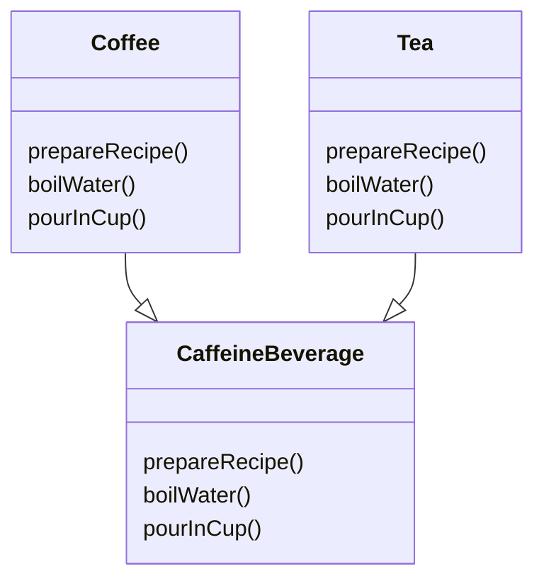

# The template method pattern

## Meet the template method
prepareRecipe() is our template method. Why ?
1. It is a method.
2. It serves as a template for algorithm.

The template method defines the steps of an algorithm and allows subclasses to provide the
implementation for one or more steps.

## What did the template method get us ?
- [x] Control the algorithm
- [x] Reduce duplicate code
- [x] Reduce multiple change because the algorithm lives in one place

## Template method pattern defined

The template method pattern defines the skeleton of an algorithms in a method, deerring some steps to subclasses. Template Method lets subclasses redefine certain steps off an algorithm without changing the algorithm's structure.
